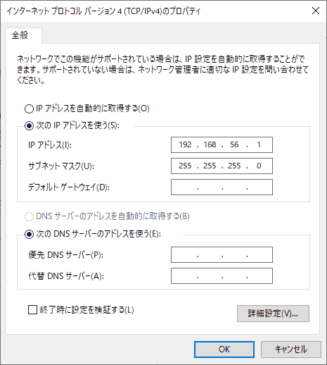

# vagrant-golang

## FAQ
<dl>
    <dt><b>If vagrant fails to create the host-only adapter.</b></dt>
    <dd>Sometitmes VirtualBox raises "VBoxManage.exe: error: Failed to create the host-only adapter" error. VirtualBox Host-Only Ethernet Adapter is usually assigned 192.168.33.0/24 subnet. But if you installed Docker or you reinstalled VitualBox without uninstalling, it would assigned different range of subnet like below. </dd>
</dl>
 